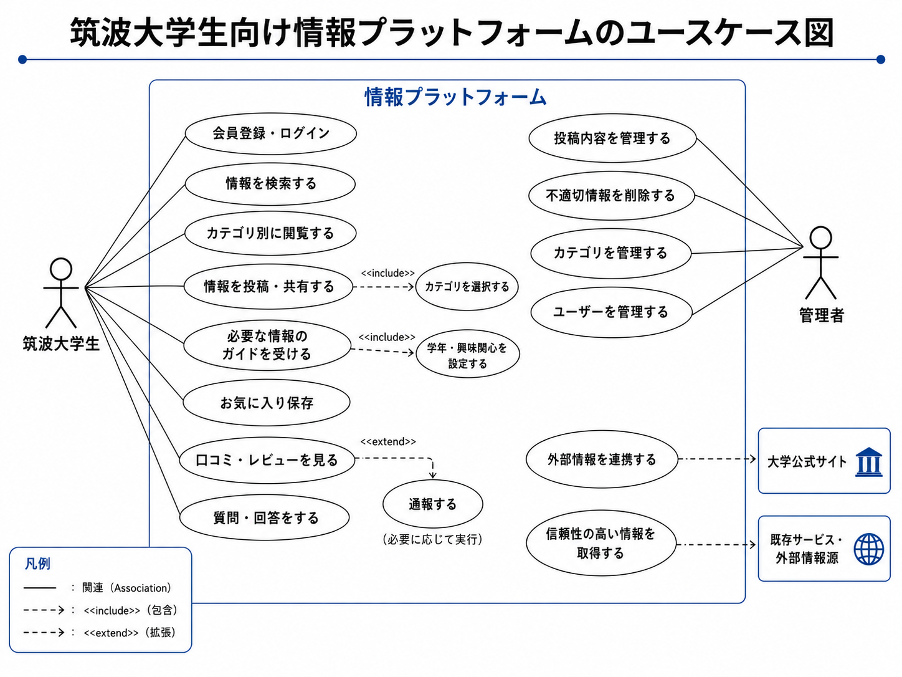

# 要件定義書

## １. 概要

### 1-1. 背景・目的

現在、筑波大学生が必要な情報は、さまざまな場所に分散している。

SNS、LINE、大学公式サイト、掲示板、記事、先輩の口コミ、個別のWebサイトなどに情報が分かれており、学生が必要な情報を探すのに時間がかかっている。

また、正確で有益な情報は、一部の学生やコミュニティに偏っていることが多く、知り合いや先輩が少ない学生ほど情報を得にくい。

その結果、学生によって得られる情報量に差が生まれ、大学生活の選択肢や意思決定に影響が出ている。

このサービスの主な目的は、筑波大学生の情報格差をなくし、誰でも必要な情報に手軽にたどり着くことができ、より多くの学生が快適な生活を送ることである。

### 1-2. 解決したい課題

#### 正確で有益な情報が一部の学生やコミュニティに偏っている

授業、過去問、サークル、アルバイト、就活などの情報は、先輩や知り合いから得られることが多い。

そのため、情報を持っているコミュニティに所属している学生は有利だが、知り合いが少ない学生や新入生、編入生、留学生は必要な情報を得にくい。

#### 情報分野が分散している

筑波大学生に必要な情報は、分野ごとに別々の場所に存在している。

例えば、授業情報は口コミや履修支援サービス、サークル情報はSNS、就活情報は別のWebサイト、飲食店情報はGoogleマップや口コミサイトに分かれている。

#### 必要な情報が何か分かっていない

学生は、学年や状況によって必要な情報が変わる。

しかし、特に新入生や低学年の学生は、自分が今どんな情報を知るべきなのか分からないことがある。

例えば、1年生は履修、サークル、新歓、住居、アルバイトなどの情報が必要だが、何から調べればよいか分からない場合がある。

### 1-3. システムの位置づけ

このサービスは、大学公式サイト、manaba、TWINSなどを置き換えるものではない。

履修登録、成績確認、学費支払いなどの公式手続きを行うサービスではなく、学生生活に役立つ情報を探しやすく整理するためのサービスである。

また、「Twin:te」「えりたん」など既存の学生向けサービスと必要に応じて共存や連携も検討している。

### 1-4. スコープ

筑波大学生の中でも、快適な生活を送りたいが、そのために必要な情報が手軽に手に入らない学生を主なターゲットとしている。

## ２. 機能要件

- どんなことができるのか
    - 筑波大学生であれば誰でも履修、サークル、飲食店、住まい、バイト、就活、留学などに関する情報を投稿・共有できる機能を設ける。
    - 複数の情報源や既存サービスと連携し、信頼性の高い情報を一つのプラットフォーム上で閲覧できるようにする。
    - 学年、所属、興味関心、現在の悩みなどに応じて、必要な情報を案内するガイド機能を設ける。
- ユースケース

- どんな情報を集めるか
1. 過去問・テスト情報
    1. 収集方法
        - コメント
            - ユーザーが共有できる場を作る
            - ユーザーに自主的に共有してもらう
2. 履修・楽単情報
    1. 収集方法
        - コメント・フォーム
        - 管理者が記事を作成する
3. 就活・インターン情報
    1. 収集方法
        - 管理者が記事を作成する
        - 既存サービスと連携する
    2. インターン情報
        - カレンダーを作成する
        - 各企業の公式サイトから情報を収集する
        - AIを活用して情報収集・整理を行う
4. サークル・部活情報
    1. 収集方法
        - 各サークル・部活が情報を登録・更新する
5. 大学の制度・手続き情報
    1. 収集方法
        - 大学公式サイトなどから情報を収集する
        - 公式情報へのリンクを掲載する
6. 学食情報
    1. 収集方法
        - 大学が公開している情報を利用する
        - 既存の口コミ情報を参考にする
        - コメント機能によって学生から情報を集める
        - 大学側が公開していない情報については、ユーザー投稿で補完する

- 評価を書いてもらう工夫
1. 授業の振り返りついでに毎週書いてもらう
2. 授業がすべて終わった後に評価してもらう
3. Twin:teなどの既存サービスから利用者を流入させる

### ３. 非機能要件

Webアプリを作成。

余裕があれば同機能を持たせたiOS、Androidアプリを作成。

- どのような情報が必要で、それらをどのように集めるか

どのような情報が必要か

1. 過去問情報
2. 履修・楽単情報
3. 就活インターン情報
4. 飲食店・ご飯情報
5. 大学の制度・手続き情報

どのように情報を集めるのか

### ４. **データ要件**

未定

### ５.画面要件

未定

### ６.外部インターフェース

未定