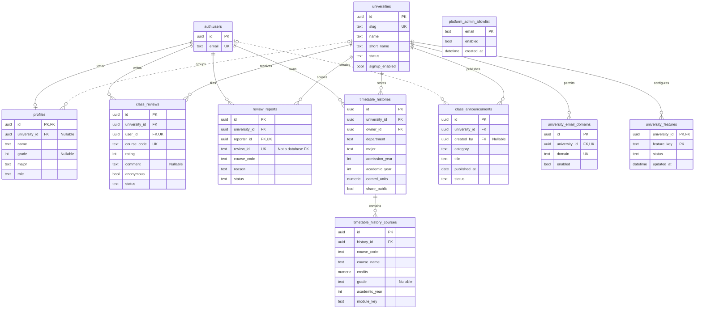
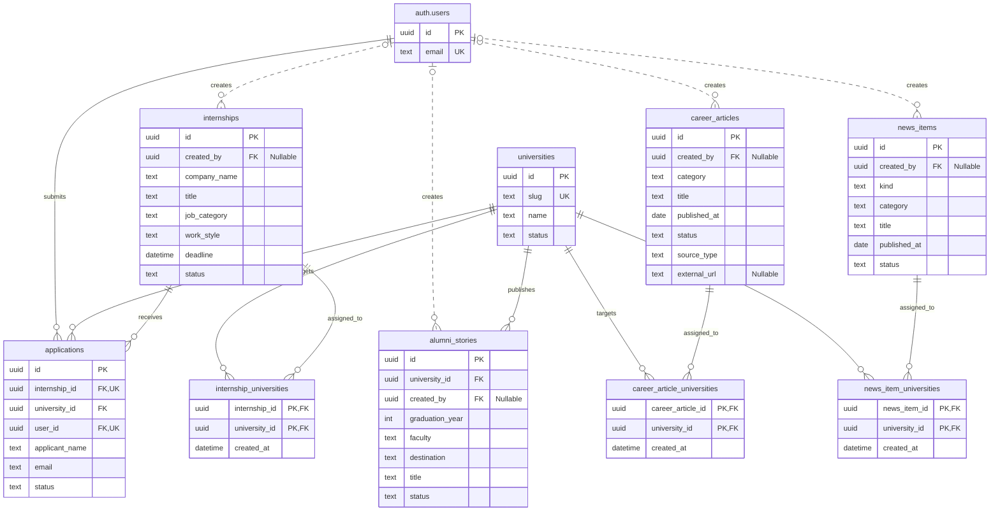
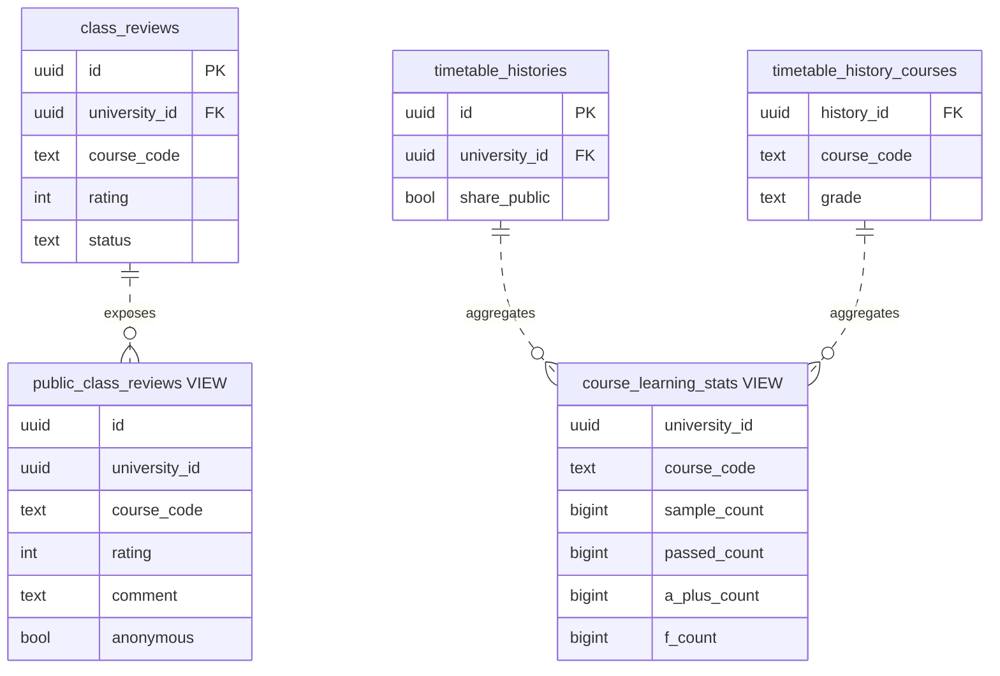

# TsukuHub database ER diagram

Snapshot of the running local Supabase `public` schema on 2026-08-15.
The schema contains 18 base tables and 2 read-only views. `auth.users` is shown
as an external Supabase Auth table. To keep the diagrams readable, only keys
and important domain columns are included. Course catalog metadata is not a
database table; it is served from static JSON (`public/data/courses/{slug}.json`).

## University, accounts, and classes

## Career and published content

## Read-only views

These lines represent view dependencies, not foreign-key constraints.

## Constraints that are easy to miss

- `class_reviews(course_code, user_id)` is unique. `course_code` is a catalog
  key from static JSON, not a database foreign key.
- `review_reports(review_id, reporter_id)` is unique, but `review_id` is stored
  as text and is not a foreign key to `class_reviews`.
- `applications(internship_id, user_id)` is unique.
- University targeting for internships, career articles, and news is modeled
  through junction tables.
- `profiles.university_id` is nullable; most other university-scoped foreign
  keys are required.
